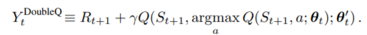
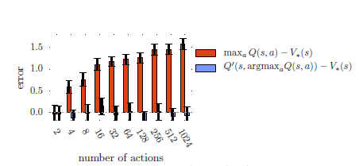
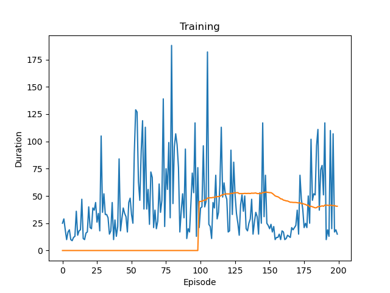
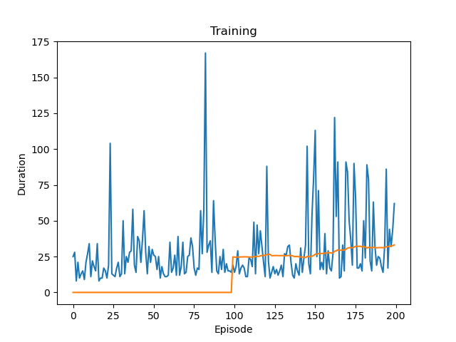

# DDQN

기존 dqn의 overestimate 문제를 해결하였다.

dqn은 해당 state의 max값을 취하기 때문에, state가 overestimate 될 수 있다.

기존의 dqn이랑 다르게 ddqn은 policy network에서 Q값을 최대로 하는 action 을 찾고, target network에서 값을 측정한다.

즉, select와 estimate가 따로 작동한다.

그래프를 보면 action이 많을 수록 dqn은 error가 높은 것을 볼 수 있다.

## 실험

cartpole을 이용하여 두 알고리즘의 차이를 보았다.

이는 dqn이고,

이는 ddqn으로 학습한 결과이다.

cartpole은 action 수가 적어서 그런지, 생각보다 큰 차이를 보이지 않았다.

episode가 적어서 그런 것인지 잘 모르겠지만, 학습이 잘 되지 않는다.

우선 개념만 알고 넘어갈 것이고, 기회가 된다면 action이 많은 환경도 다루어 볼 것이다.
