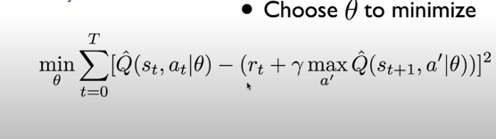

# DQN

기존의 q network에서는 correlation 문제가 있었다.

reinforcement learning에서는 state들 간의 correlation 이 있어서, q network 같은 방법으로는 학습이 잘 되지 않는다.

그래서 dqn에서는 ReplayMemory 라는 것을 도입했다.

state,action,reward,next_state를 memory에 넣고, memory에 있는 것 중 무작위로 하나를 뽑아서 사용하는 방법이다.

또 다른 문제점으로는 non-stationary 문제가 있다.

이와 같이 label에 해당하는 부분이 계속 바뀌어서 분포가 계속 바뀌게 된다.

이를 해결한 방법은 network를 2개 이용한다. label에 해당하는 target network와  학습에 이용할 network 2개를 이용한다.

물론 target network도 학습을 해주어야 올바른 label 값이 나오기 떄문에, n-step 마다 학습에 이용한 network의 값으로 바꿔준다. 이를 이용하여 분포가 변하는 것을 억제했다.
