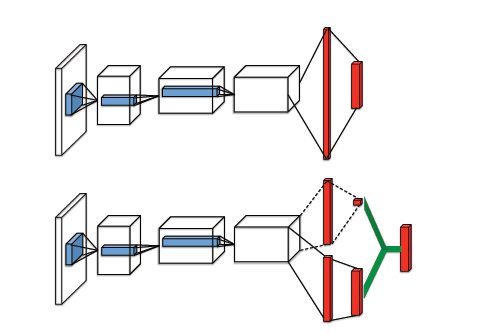
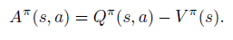
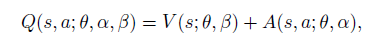
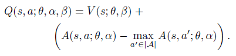
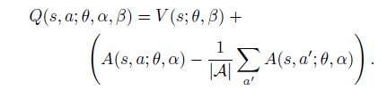

# Dueling DQN

기존의 dqn, ddqn은 cnn layer 뒤에 하나의 fully connected layer를 통하여 q 값을 측정했다.

문제는 특정 state에서 action이 별 영향을 끼지치 않는 경우이다. 또는 영향을 끼칠 수도 있다.

이를 측정하기 위해 advantage function이라는 것을 도입한다.

dueling dqn은 두 개의 fc layer를 이용한다. 하나는 value(scalar), 하나는 advantage function(matrix)이다.

아래가 dueling dqn이다. 첫 번째 fc layer의 output 크기를 보면 scalar이다. 이는 V(s;theta,alpha) 를 의미한다.

두 번째 fc layer은 A(s,a;theta,beta) 이다. action 개수 만큼 필요하다.

advantage function은 다음과 같다.

내가 이 식을 이해한 바로는, 해당 action이 얼마만큼 이 state에 영향을 끼치는 지 알 수 있는 식인 것 같다.

V같은 경우에는 모든 action에 대한 Q를 구한 후에 이를 평균을 취해주면 된다. 그렇기 때문에, 해당 action의 영향이 클 수록 큰 값이 나온다.

이 식은 최종 output이다. 여기서는 단순히 2개를 더했다. 이렇게 할 경우에는 unidentifiable 한 문제가 발생한다.

V랑 Q중에 무엇이 Q에 영향을 줬는지 알 수가 없다.

그 식을 보완한 것이 다음 식이다.

괄호 부분은 0보다 같거나 작은 값이 나온다. 왜냐하면 max 값을 빼주기 때문이다. 그래서 0이 나온다면, 좋은 action을 선택했다고 볼 수 있다. 좋지 않은 action을 선택하게 된다면, 기존의 V 값 보다 작아지게 된다.

다른 버전의 수식이다. 이는 max가 아닌 평균값을 빼준다. max값을 취해주는 식처럼 최적의 action을 계산할 순 없지만, 최적화 과정에서 이득을 본다고 한다. 이 논문에서는 대부분의 experiment에서 평균을 취해주는 방법을 사용했다고 한다.
