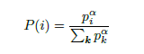
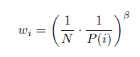
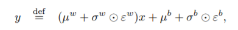
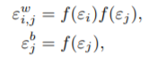
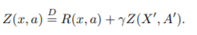
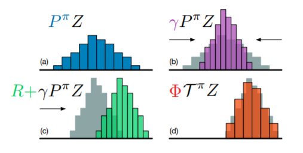
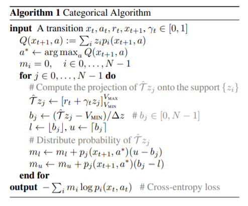

# rainbow

rainbow 는 기존의 dqn 시리즈들을 섞어놓았다. 그래서 사전 지식이 좀 많이 필요하다. 

## 사전지식

### Prioritized Experience Replay(PER)

기존의 dqn에서는 replay memory에서 무작위로 뽑았었다. 

PER은 중요한 경험을 자주 재사용하도록 하는 것이다.

TD error를 구하고, 이를 통해 prioritized buffer 를 만든다.

k는 buffer에 들어있는 transition의 총 갯수이고, alpha는 0이면 uniform, 1이면 greedyg 이다. 얼마나 prioritization에 의한 sample을 할 것인지 나타낸다.

Prioritized Replay는  bias를 가져오는데, 주로 expectation에 대한 분포가 update마다 바뀌기 때문이다.

논문에서는 importance-sampling(IS) weights를 이용해 bias를 잡는다.

beta 는 hyperparameter이다.

### NoisyNet

기존에는 y = wx+b 라는 식을 이용했다.

여기에 noise를 주어서 학습을 하게 된다.

입실론은 random variable이고, 나머지는 학습을 해야되는 파라미터이다.

Factorised Gaussian noise를 이용하여 입실론을 구한다고 한다. 

이 distribution이 무엇인지 솔직히 잘 모르겠다... 

여기서 f는 real-valued function이다. 논문에서는 f(x) = sgn(x)sqrt(abs(x)) 이다.

### Distributional dqn

기존의 dqn은 q value 를 학습하는 데에 중점을 두었다면, 이 논문은 value 하나가 아닌, distribution 자체를 학습한다.

이 식은 distributional Bellam equation 이고, Z가 분포이다.

먼저 distribution을 구한 후에, discount factor만큼 곱해준다. 그리고 reward만큼 이동시켜 주고, projection을 통해 target과 학습하고 있는 distrubution의 support의 범위를 같게 해준다.

rainbow에서는 l2 projection을 이용한다고 되어있다. 

알고리즘은 위와 같다(C51).